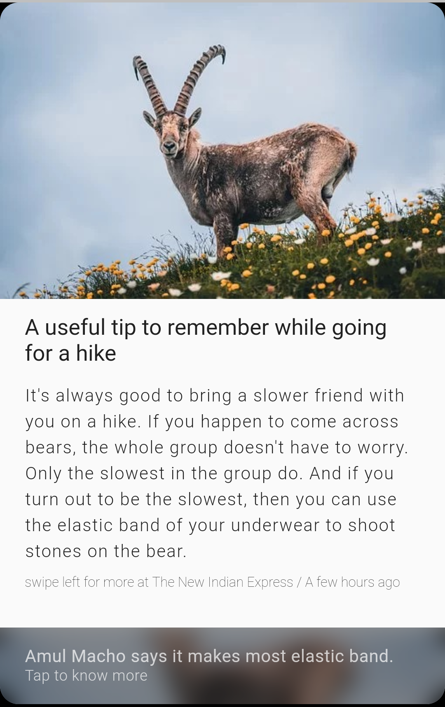

*Work in Progress....*

# Inshorts Clone

 

 Just the UI has been completed till now. The news has been hardcoded. The plan is to get some news from an API and format the news appropiately to show in the UI. This will be updated as I work on it. 

## Getting Started

This project is a starting point for a Flutter application.

A few resources to get you started if you also want to make cool apps:

- [Lab: Write your first Flutter app](https://flutter.dev/docs/get-started/codelab)
- [Cookbook: Useful Flutter samples](https://flutter.dev/docs/cookbook)

For help getting started with Flutter, view our
[online documentation](https://flutter.dev/docs), which offers tutorials,
samples, guidance on mobile development, and a full API reference.
